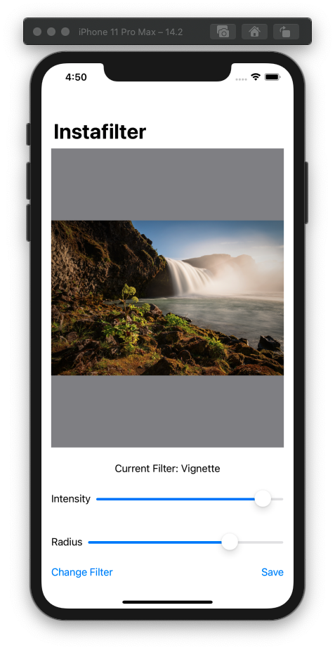
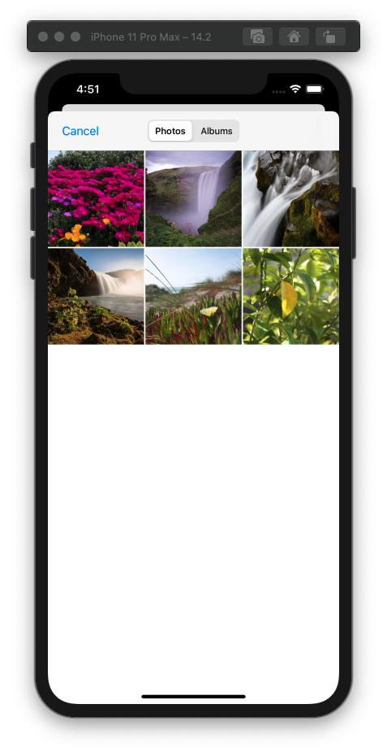
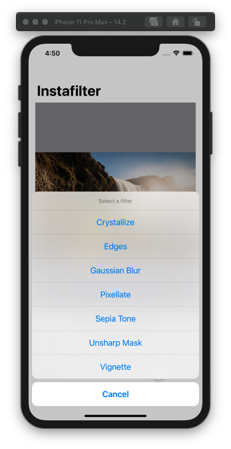

# Instafilter

An iOS app that lets you select a photo from your photo library and apply a filter to it. 
Seven filters available, with options to adjust filter parameters.
Modified photos can be saved to your photo library.
Built with SwiftUI and UIKit.

## 📸 Screenshots

